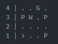
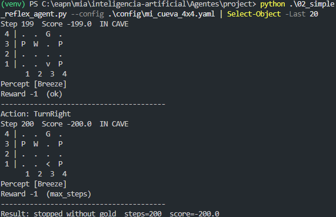
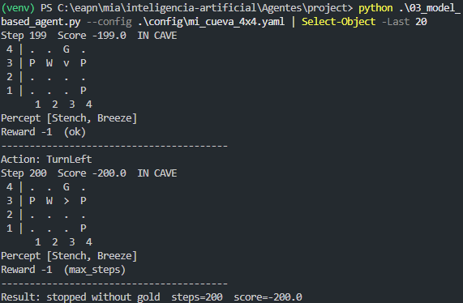
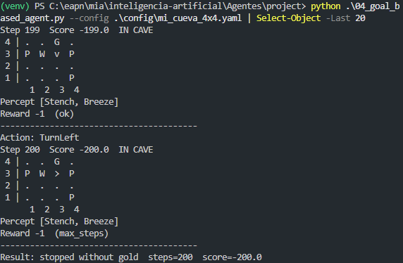
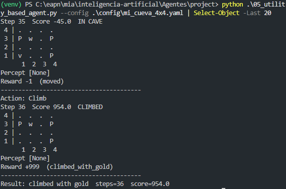
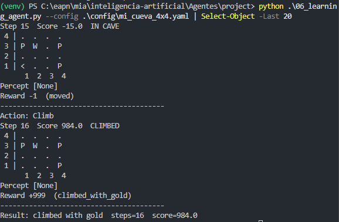
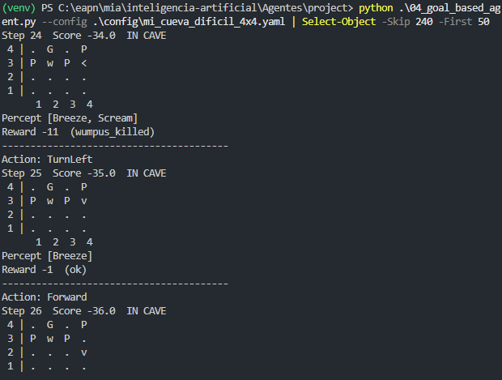

# Ejercicio 1 — Modificar el Mundo de Wumpus

## Objetivo

Crear una variante del mapa clásico de Wumpus modificando la ubicación del **Wumpus** y los **pits**, y observar cómo estos cambios afectan el comportamiento de los diferentes agentes.

## Requisitos

Crear `mi_cueva_4x4.yaml` a partir de `classic_4x4.yaml`:

- Mantener el mundo 4x4 y el agente en `[1, 1]`.
- Cambiar la posición del Wumpus.
- Cambiar la posición de al menos 2 pits.
- Mantener el oro en una posición alcanzable.
- Evitar solapamientos entre agente, Wumpus, pits y oro.
- Mantener al menos un camino seguro entre el agente y el oro.

## Entrega

- [`mi_cueva_4x4.yaml`](./mi_cueva_4x4.yaml)
- Evidencias de ejecución en [`screenshots/`](./screenshots/)
- Análisis de los resultados

## Diagrama

## Reporte

En el mapa que escogí, los agentes que lograron salir con el oro fueron el agente basado en utilidad y el agente de aprendizaje. El agente de reflejo simple, el agente basado en modelo y el agente basado en metas no lograron completar el objetivo: se quedaron dentro de la cueva hasta llegar al límite de pasos. Observé que el agente basado en modelo y el agente basado en metas tienden a no avanzar cuando el Wumpus o un pit quedan cerca de la ruta hacia el oro, porque evitan entrar a casillas que no pueden confirmar como seguras.

El agente de reflejo falla por la naturaleza de su implementación: si no percibe nada, avanza en línea recta; si percibe señales como brisa o hedor, reacciona localmente sin construir un modelo del mundo. Podría tener suerte si el oro estuviera en una ruta directa y sin percepciones peligrosas, pero en este diseño encuentra una brisa antes de llegar al oro y termina moviéndose en círculos. Tal vez si añadiéramos una regla para avanzar después de girar, podría salir de algunos bucles.

Para el agente basado en modelo, percibí que mientras más cerca esté un pit de la casilla inicial, es más probable que se quede en un bucle sin avanzar. Cuando el pit está más alejado, el agente puede marcar más casillas como seguras y moverse con más libertad antes de encontrar una situación peligrosa.

## Evidencias

### Agente de reflejo simple

### Agente basado en modelo

### Agente basado en metas

### Agente basado en utilidad

### Agente de aprendizaje

## Reto opcional

Para el reto opcional configuré una segunda cueva en [`mi_cueva_dificil_4x4.yaml`](./mi_cueva_dificil_4x4.yaml). En esa variante, el Wumpus está en `[2, 3]` y bloquea el paso directo hacia el oro en `[2, 4]`; los pits en `[1, 3]`, `[3, 3]` y `[4, 4]` cierran las rutas alternativas. En el diagrama que elegí, observé que el agente basado en metas sí disparó y mató al Wumpus, pero después no logró tomar el oro y se quedó en círculos antes de completar el objetivo.

