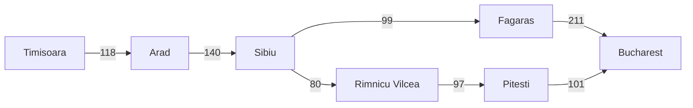

# Ejercicio 1 - Búsqueda no informada

## Objetivo

Comparar algoritmos de búsqueda no informada en el mapa de Rumania usando una pareja origen-destino distinta de `Arad -> Bucharest`.

## Pareja elegida

- **Origen:** Timisoara
- **Destino:** Bucharest

## Comandos ejecutados

```bash
cd "Búsqueda no informada/project"
```

```bash
python 02_breadth_first_search.py --from-city Timisoara --to Bucharest
python 03_uniform_cost_search.py --from-city Timisoara --to Bucharest
python 04_depth_first_search.py --from-city Timisoara --to Bucharest
python 05_depth_limited_search.py --from-city Timisoara --to Bucharest --limit 3
python 05_depth_limited_search.py --from-city Timisoara --to Bucharest --limit 4
python 06_iterative_deepening_search.py --from-city Timisoara --to Bucharest
```

## Diagrama del subgrafo

### Versión Mermaid



### Versión ASCII

```text
Timisoara --118-- Arad --140-- Sibiu --99-- Fagaras --211-- Bucharest
                              |
                              | 80
                              |
                       Rimnicu Vilcea --97-- Pitesti --101-- Bucharest
```

**Camino BFS / DFS / IDS:**  
Timisoara -> Arad -> Sibiu -> Fagaras -> Bucharest  
Costo: 118 + 140 + 99 + 211 = 568 km

**Camino UCS:**  
Timisoara -> Arad -> Sibiu -> Rimnicu Vilcea -> Pitesti -> Bucharest  
Costo: 118 + 140 + 80 + 97 + 101 = 536 km

## Tabla comparativa

| Algoritmo             | Status  | Path                                                                 | Depth (carreteras) | Cost (km) | Expanded | Generated |
| --------------------- | ------- | -------------------------------------------------------------------- | -----------------: | --------: | -------: | --------: |
| BFS                   | success | Timisoara -> Arad -> Sibiu -> Fagaras -> Bucharest                   |                  4 |       568 |        8 |        19 |
| UCS                   | success | Timisoara -> Arad -> Sibiu -> Rimnicu Vilcea -> Pitesti -> Bucharest |                  5 |       536 |       12 |        31 |
| DFS                   | success | Timisoara -> Arad -> Sibiu -> Fagaras -> Bucharest                   |                  4 |       568 |        4 |        12 |
| DLS límite bajo       | cutoff  | -                                                                    |                  - |         - |        6 |        16 |
| DLS límite suficiente | success | Timisoara -> Arad -> Sibiu -> Fagaras -> Bucharest                   |                  4 |       568 |        4 |         6 |
| IDS                   | success | Timisoara -> Arad -> Sibiu -> Fagaras -> Bucharest                   |                  4 |       568 |       14 |        34 |

## Reporte

En la búsqueda de Timisoara a Bucharest, BFS y UCS no dieron el mismo camino. BFS encontró `Timisoara -> Arad -> Sibiu -> Fagaras -> Bucharest`, con 4 carreteras y 568 km. UCS encontró `Timisoara -> Arad -> Sibiu -> Rimnicu Vilcea -> Pitesti -> Bucharest`, con 5 carreteras y 536 km. BFS buscó el camino con menos carreteras y UCS el de menos kilómetros.

DFS encontró el mismo camino que BFS en esta prueba. También expandió menos nodos, pero eso depende del orden en que revisa las ciudades. Puede encontrar primero un camino que no sea el más corto ni el más barato.

Con DLS, el límite de 3 no alcanzó para llegar a Bucharest y dio _cutoff_. Con límite de 4 sí encontró el camino. IDS también encontró el mismo camino que BFS con profundidad 4, pero expandió más nodos porque tuvo que probar los límites anteriores antes de llegar al 4.

## Evidencias

Agregar aquí capturas o salidas de terminal.

### BFS

```text
Algorithm: BFS
Problem:   Timisoara -> Bucharest
Status:    success
Path:      Timisoara -> Arad -> Sibiu -> Fagaras -> Bucharest
Depth:     4 roads
Cost:      568 km
Expanded:  8 nodes
Generated: 19 nodes
Frontier:  max size 5
```

### UCS

```text
Algorithm: UCS
Problem:   Timisoara -> Bucharest
Status:    success
Path:      Timisoara -> Arad -> Sibiu -> Rimnicu Vilcea -> Pitesti -> Bucharest
Depth:     5 roads
Cost:      536 km
Expanded:  12 nodes
Generated: 31 nodes
Frontier:  max size 4
```

### DFS

```text
Algorithm: DFS
Problem:   Timisoara -> Bucharest
Status:    success
Path:      Timisoara -> Arad -> Sibiu -> Fagaras -> Bucharest
Depth:     4 roads
Cost:      568 km
Expanded:  4 nodes
Generated: 12 nodes
Frontier:  max size 7
```

### DLS - límite bajo

```text
Algorithm: DLS
Problem:   Timisoara -> Bucharest
Status:    cutoff
Detail:    limit=3
Expanded:  6 nodes
Generated: 16 nodes
Frontier:  max size 7
```

### DLS - límite suficiente

```text
Algorithm: DLS
Problem:   Timisoara -> Bucharest
Status:    success
Detail:    limit=4
Path:      Timisoara -> Arad -> Sibiu -> Fagaras -> Bucharest
Depth:     4 roads
Cost:      568 km
Expanded:  4 nodes
Generated: 6 nodes
Frontier:  max size 7
```

### IDS

```text
Algorithm: IDS
Problem:   Timisoara -> Bucharest
Status:    success
Detail:    last_limit=4
Path:      Timisoara -> Arad -> Sibiu -> Fagaras -> Bucharest
Depth:     4 roads
Cost:      568 km
Expanded:  14 nodes
Generated: 34 nodes
Frontier:  max size 7
```

## Reto opcional

### Pareja para comparar BFS y UCS

- **Origen:** Timisoara
- **Destino:** Bucharest

### Resultados del reto

| Algoritmo | Path                                                                 | Depth (carreteras) | Cost (km) | Expanded | Generated |
| --------- | -------------------------------------------------------------------- | -----------------: | --------: | -------: | --------: |
| BFS       | Timisoara -> Arad -> Sibiu -> Fagaras -> Bucharest                   |                  4 |       568 |        8 |        19 |
| UCS       | Timisoara -> Arad -> Sibiu -> Rimnicu Vilcea -> Pitesti -> Bucharest |                  5 |       536 |       12 |        31 |

### Comparación

BFS eligió un camino con menos carreteras, pero con más kilómetros: llegó en 4 carreteras con costo de 568 km. UCS eligió un camino más barato en kilómetros, aunque usó más carreteras: llegó en 5 carreteras con costo de 536 km.

Me pareció curioso que UCS trabajara más en esta instancia. Usualmente esperas qyue BFS fuera más pesado por la misma explicación que se le da sobre que guarda todo lo expandido en memoria, pero aquí UCS expandió y generó más nodos. Esto tiene sentido porque UCS tuvo que seguir comparando costos acumulados para asegurar el camino más barato, mientras que BFS solo buscó el camino con menos carreteras. También depende de que métrica se compare: UCS expandió más nodos, pero BFS tuvo una frontera máxima un poco mayor.

### Variación de destino

- **Mismo origen:** Timisoara
- **Destino 1:** Fagaras
- **Límite mínimo DLS:** 3
- **Destino 2:** Bucharest
- **Límite mínimo DLS:** 4

Al mantener el mismo origen y cambiar solo el destino, el límite mínimo de DLS aumentó de 3 a 4. Para llegar a Fagaras, el camino encontrado es `Timisoara -> Arad -> Sibiu -> Fagaras`, que tiene profundidad 3. Para llegar a Bucharest, DLS necesita un nivel más porque el camino encontrado es `Timisoara -> Arad -> Sibiu -> Fagaras -> Bucharest`, con profundidad 4. Por eso `--limit 3` alcanza Fagaras, pero para Bucharest produce _cutoff_; al subir a `--limit 4`, ya encuentra solución.
