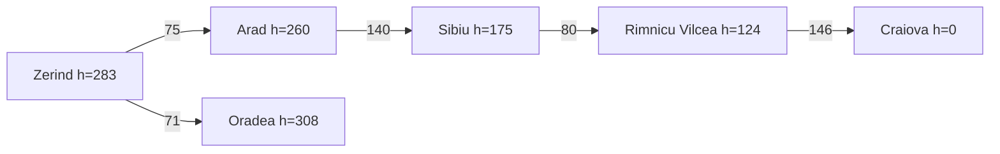

# Ejercicio 1 - Búsqueda informada

## Objetivo

Comparar Greedy best-first search y A\* en el mapa de Rumania con una pareja distinta de `Arad -> Bucharest`.

## Pareja elegida

- **Origen:** Zerind
- **Destino:** Craiova

## Comandos ejecutados

```bash
cd "Búsqueda informada/project"
```

```bash
python 02_heuristics.py --from-city Zerind --to Craiova
python 03_greedy_best_first_search.py --from-city Zerind --to Craiova
python 04_a_star_search.py --from-city Zerind --to Craiova
```

## Heurística usada

Se usó la distancia euclidiana hacia Craiova usando las coordenadas del mapa. No se usó la tabla AIMA, porque esa tabla solo es para Bucharest.

## Valores de h en las ciudades vecinas al origen

| Ciudad vecina | h(n) |
| ------------- | ---: |
| Arad          |  260 |
| Oradea        |  308 |

## Diagrama del subgrafo

### Versión Mermaid



### Versión ASCII

```text
Zerind (h=283) --75-- Arad (h=260) --140-- Sibiu (h=175) --80-- Rimnicu Vilcea (h=124) --146-- Craiova (h=0)
    |
    | 71
    |
Oradea (h=308)
```

## Tabla comparativa

| Algoritmo | Status  | Path                                                 | Depth (carreteras) | Cost (km) | Expanded | Generated | Heurística |
| --------- | ------- | ---------------------------------------------------- | -----------------: | --------: | -------: | --------: | ---------- |
| Greedy    | success | Zerind -> Arad -> Sibiu -> Rimnicu Vilcea -> Craiova |                  4 |       441 |        4 |        13 | Euclidiana |
| A\*       | success | Zerind -> Arad -> Sibiu -> Rimnicu Vilcea -> Craiova |                  4 |       441 |        7 |        19 | Euclidiana |

## g, h y f en el camino

### Greedy

| Ciudad         | g(n) | h(n) | f(n) |
| -------------- | ---: | ---: | ---: |
| Zerind         |    0 |  283 |  283 |
| Arad           |   75 |  260 |  335 |
| Sibiu          |  215 |  175 |  390 |
| Rimnicu Vilcea |  295 |  124 |  419 |
| Craiova        |  441 |    0 |  441 |

### A\*

| Ciudad         | g(n) | h(n) | f(n) |
| -------------- | ---: | ---: | ---: |
| Zerind         |    0 |  283 |  283 |
| Arad           |   75 |  260 |  335 |
| Sibiu          |  215 |  175 |  390 |
| Rimnicu Vilcea |  295 |  124 |  419 |
| Craiova        |  441 |    0 |  441 |

## Reporte

En esta instancia Greedy y A* encontraron el mismo camino: `Zerind -> Arad -> Sibiu -> Rimnicu Vilcea -> Craiova`. Tiene 4 carreteras y cuesta 441 km. A* encontró el camino de menos kilómetros, y Greedy coincidió porque las ciudades que le parecían más cercanas a Craiova lo llevaron también a esa ruta. Greedy puede devolver un camino más caro porque no garantiza encontrar el mejor camino, solo sigue uno que parece más ligero según `h` y que tal vez sea el óptimo, como ocurrió aquí, pero no siempre.

La diferencia se nota después de expandir Arad. Greedy vio que Sibiu tenía `h=175`, menor que Timisoara con `h=200` y Oradea con `h=308`, así que eligió Sibiu. A* tomó primero Oradea aunque su `h` era mayor, porque tenía `f=379`: llegar a Oradea desde Zerind costaba 71 km. Para Sibiu, A* tenía `f=390`, porque ya había recorrido 215 km. Greedy ignora ese costo recorrido y por eso puede terminar en un camino más caro en otros casos.

En el camino de A\*, los valores de `f` fueron 283, 335, 390, 419 y 441. No disminuyeron conforme avanzó la ruta. En esta prueba se usó la heurística euclidiana hacia Craiova.

## Evidencias

### Heurísticas

```text
Heuristic: Euclidean distance to Craiova (map coordinates)

  h(n)  city
      0  Craiova  <- goal
     89  Drobeta
     99  Mehadia
    104  Pitesti
    123  Giurgiu
    124  Rimnicu Vilcea
    127  Lugoj
    152  Bucharest
    169  Fagaras
    175  Sibiu
    200  Timisoara
    212  Urziceni
    260  Arad
    283  Zerind  <- start
    288  Hirsova
    292  Neamt
    300  Vaslui
    308  Oradea
    309  Eforie
    310  Iasi
```

### Greedy

```text
Algorithm: Greedy best-first search
Problem:   Zerind -> Craiova
Heuristic: Euclidean distance to Craiova (map coordinates)
Status:    success
Path:      Zerind -> Arad -> Sibiu -> Rimnicu Vilcea -> Craiova
Depth:     4 roads
Cost:      441 km

  city                  g     h     f
  Zerind                0   283   283
  Arad                 75   260   335
  Sibiu               215   175   390
  Rimnicu Vilcea      295   124   419
  Craiova             441     0   441

Expanded:  4 nodes
Generated: 13 nodes
Frontier:  max size 5
```

### A\*

```text
Algorithm: A* search
Problem:   Zerind -> Craiova
Heuristic: Euclidean distance to Craiova (map coordinates)
Status:    success
Path:      Zerind -> Arad -> Sibiu -> Rimnicu Vilcea -> Craiova
Depth:     4 roads
Cost:      441 km

  city                  g     h     f
  Zerind                0   283   283
  Arad                 75   260   335
  Sibiu               215   175   390
  Rimnicu Vilcea      295   124   419
  Craiova             441     0   441

Expanded:  7 nodes
Generated: 19 nodes
Frontier:  max size 4
```

## Reto opcional

### Comparación con UCS

| Algoritmo | Path                                                 | Depth (carreteras) | Cost (km) | Expanded | Generated |
| --------- | ---------------------------------------------------- | -----------------: | --------: | -------: | --------: |
| Greedy    | Zerind -> Arad -> Sibiu -> Rimnicu Vilcea -> Craiova |                  4 |       441 |        4 |        13 |
| A\*       | Zerind -> Arad -> Sibiu -> Rimnicu Vilcea -> Craiova |                  4 |       441 |        7 |        19 |
| UCS       | Zerind -> Arad -> Sibiu -> Rimnicu Vilcea -> Craiova |                  4 |       441 |       10 |        26 |

### Cambio de destino

- **Origen:** Zerind
- **Destino 1:** Craiova
- **Heurística usada:** Distancia euclidiana hacia Craiova
- **Destino 2:** Bucharest
- **Heurística usada:** Distancia en línea recta hacia Bucharest de la tabla AIMA

```bash
python 02_heuristics.py --from-city Zerind --to Bucharest
python 03_greedy_best_first_search.py --from-city Zerind --to Bucharest
python 04_a_star_search.py --from-city Zerind --to Bucharest
```

| Destino | Algoritmo | Path                                                        | Depth | Cost (km) | Expanded | Generated |
| ------- | --------- | ----------------------------------------------------------- | ----: | --------: | -------: | --------: |
| Craiova | Greedy    | Zerind -> Arad -> Sibiu -> Rimnicu Vilcea -> Craiova        |     4 |       441 |        4 |        13 |
| Craiova | A\*       | Zerind -> Arad -> Sibiu -> Rimnicu Vilcea -> Craiova        |     4 |       441 |        7 |        19 |
| Bucharest | Greedy  | Zerind -> Arad -> Sibiu -> Fagaras -> Bucharest             |     4 |       525 |        4 |        12 |
| Bucharest | A\*     | Zerind -> Arad -> Sibiu -> Rimnicu Vilcea -> Pitesti -> Bucharest | 5 |   493 |        7 |        20 |

Cambiar el destino significa mantener el mismo punto de inicio y elegir otra meta. Al hacerlo también cambian los valores de `h`, porque ahora se estima la distancia hacia otra ciudad. Para Craiova se usó la distancia euclidiana y Greedy coincidió con A\*. Para Bucharest se usó la tabla AIMA y los caminos fueron diferentes: Greedy eligió el camino que parecía más cercano según `h`, pero costó 525 km. A\* tomó en cuenta `g + h` y encontró un camino de 493 km.
