# Ejercicio 1 - Más capas en el perceptrón multicapa

## Objetivo

Comparar las redes originales y las redes con dos capas ocultas extra en las implementaciones con NumPy y Keras usando el conjunto Iris.

## Notebooks en Colab

- **Notebook 01 - NumPy:** [Abrir en Colab](https://colab.research.google.com/drive/1YL9OopTiYUGp1Rzy8SSQJEUIiaMRr7yp?usp=sharing) ([archivo local opcional](./04_Multilayer_perceptron.ipynb))
- **Notebook 02 - Keras:** [Abrir en Colab](https://colab.research.google.com/drive/10xtzhOVoUPRkkA358pbeF4ICPmEL18H8?usp=sharing) ([archivo local opcional](./05_Keras_multilayer_perceptron_iris.ipynb))

## Configuración

| Configuración   | Valor    |
| --------------- | -------- |
| Entradas        | 4        |
| Salidas         | 3        |
| Activación      | Sigmoide |
| Error / pérdida | MSE      |
| Learning rate   | 0.03     |
| Épocas          | 500      |

## Arquitecturas

| Versión  | Topología         |   Capas ocultas | Capa de salida |
| -------- | ----------------- | --------------: | -------------: |
| Original | 4 x 3 x 3         | 1 de 3 neuronas |     3 neuronas |
| Profunda | 4 x 3 x 3 x 3 x 3 | 3 de 3 neuronas |     3 neuronas |

## Notebook 01 - NumPy

### Red original

- **Error final:** 0.0627910453770139
- **Resultado observado:** El error bajó de forma constante y terminó cerca de 0.06.

### Cambios para la red profunda

- [x] Agregar los pesos y sesgos de las dos capas nuevas.
- [x] Actualizar `init_weights`.
- [x] Actualizar el forward de `calculate_error`.
- [x] Actualizar la propagación en el entrenamiento.
- [x] Actualizar la retropropagación desde la salida hasta la primera capa.
- [x] Entrenar durante 500 épocas con learning rate de 0.03.

### Red profunda

- **Error final:** 0.40642383281796524
- **Resultado observado:** El error se mantuvo cerca de 0.67 durante gran parte del entrenamiento y terminó cerca de 0.41.

## Notebook 02 - Keras

### Red original

- **Loss final:** 0.14352001249790192
- **Predicción de ejemplo:** `[0.41982687, 0.31956768, 0.31110996]` (clase 0)

### Cambios para la red profunda

```python
deep_model = keras.Sequential(
    [
        layers.Dense(3, activation="sigmoid", name="deep_layer1", input_shape=(4,)),
        layers.Dense(3, activation="sigmoid", name="deep_layer2"),
        layers.Dense(3, activation="sigmoid", name="deep_layer3"),
        layers.Dense(3, activation="sigmoid", name="deep_layer4"),
    ]
)
```

### Red profunda

- **Loss final:** 0.22250834107398987
- **Predicción de ejemplo:** `[0.33147565, 0.3378692, 0.34220168]` (clase 2)

## Tabla comparativa

| Implementación | Arquitectura | Error / loss final | Resultado observado |
| -------------- | ------------ | -----------------: | ------------------- |
| NumPy          | Original     |       0.0627910454 | El error bajó de forma constante. |
| NumPy          | Profunda     |       0.4064238328 | El error se estancó durante gran parte del entrenamiento. |
| Keras          | Original     |       0.1435200125 | Predijo la clase 0 en el ejemplo. |
| Keras          | Profunda     |       0.2225083411 | Predijo la clase 2 con valores muy parecidos entre las tres salidas. |

## Reporte breve

En las dos implementaciones, agregar dos capas no mejoró el resultado. En NumPy, la red original terminó con un error de 0.06279, mientras que la profunda terminó con 0.40642. En Keras pasó algo parecido: la original obtuvo un loss de 0.14352 y la profunda terminó con 0.22251. La predicción de Keras también cambió. La red original eligió la clase 0, mientras que la profunda eligió la clase 2 y dio valores muy parecidos para las tres clases, por lo que se ve menos segura.

Las curvas de NumPy y Keras no se comportaron igual. La red original de NumPy bajó de forma constante, pero la profunda se mantuvo cerca de 0.67 durante muchas épocas y comenzó a bajar casi al final. En Keras las dos curvas bajaron de una forma más suave, aunque la profunda se estancó cerca de 0.22. Una diferencia es que el código de NumPy actualiza los pesos con un ejemplo a la vez y conserva el orden de los datos, mientras que Keras trabaja con grupos de ejemplos y mezcla los datos durante el entrenamiento. Según la documentación de `Model.fit()`, al no indicar otros valores se usa un `batch_size` de 32 y `shuffle=True`. Además, NumPy suma el error de las tres salidas y Keras calcula su promedio, así que sus valores no se pueden comparar directamente como si fueran la misma medida.

Según explicó usted en clase, después de varias capas la sigmoide puede hacer que la red aprenda cada vez menos. Al pasar el error hacia atrás por varias capas sigmoides, los cambios se pueden hacer cada vez más pequeños. Esto provoca que las primeras capas aprendan muy lento, como se observa en la parte plana de la curva profunda de NumPy. Iris es un conjunto pequeño y la red original ya puede aprenderlo sin necesitar más capas, por lo que agregar profundidad hizo más difícil el entrenamiento en lugar de mejorar el resultado.

## Referencias

- [Keras - Model training APIs](https://keras.io/api/models/model_training_apis/): documentación de `Model.fit()`, `batch_size` y `shuffle`.
- [TensorFlow - MeanSquaredError](https://www.tensorflow.org/api_docs/python/tf/keras/losses/MeanSquaredError): documentación del cálculo de la pérdida MSE.

## Evidencias

### NumPy - Red original

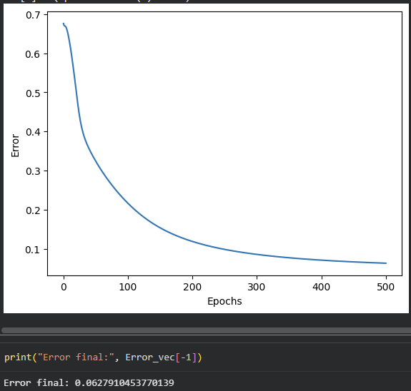

### NumPy - Red profunda

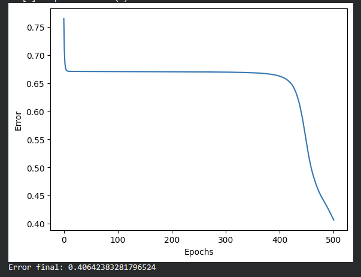

### Keras - Red original

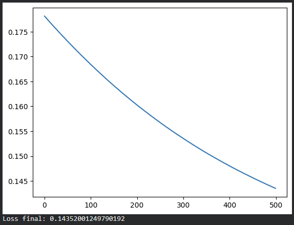

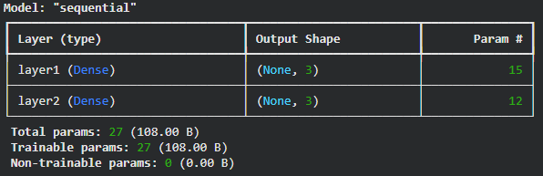

### Keras - Red profunda

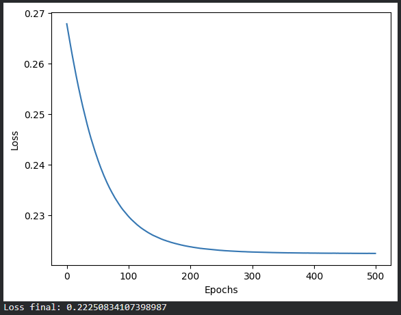

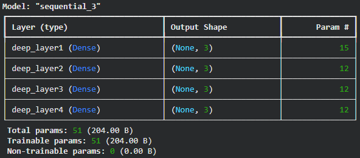

### Ejecución en Colab

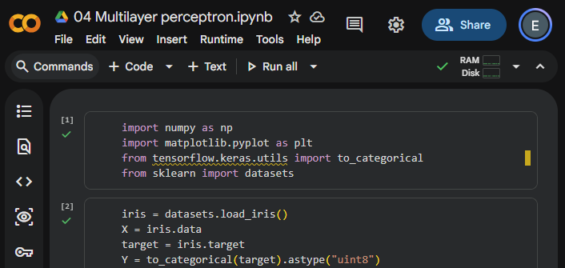

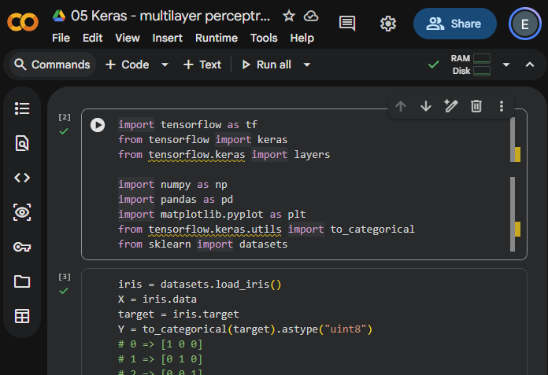

## Reto opcional

### ReLU, softmax y categorical crossentropy

| Versión                                   | Loss final | Accuracy |
| ----------------------------------------- | ---------: | -------: |
| Sigmoide + MSE                            | 0.22250834 |   33.33% |
| ReLU + softmax + categorical crossentropy | 0.19522931 |      98% |

La red con ReLU, softmax y categorical crossentropy logró clasificar correctamente el 98% de los datos, mientras que la red profunda con sigmoide y MSE obtuvo 33.33%. La curva de la nueva red también siguió bajando hasta terminar con un loss de 0.19523. Los valores de loss no se pueden comparar directamente porque cada red utiliza una función de pérdida diferente, pero la accuracy muestra que la nueva configuración clasificó mejor los datos de Iris.

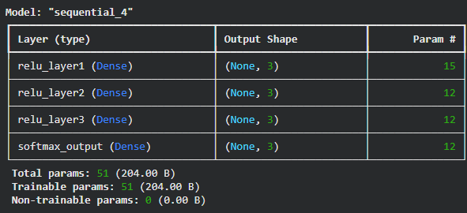

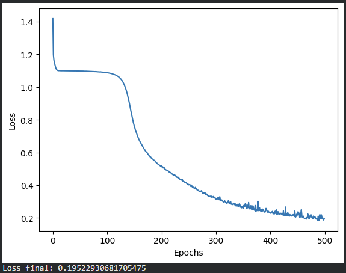

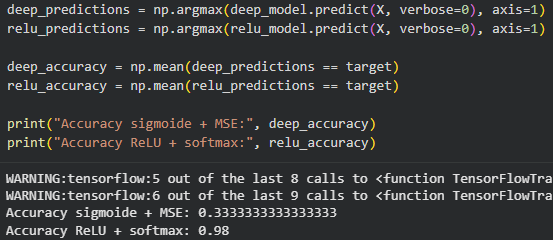
