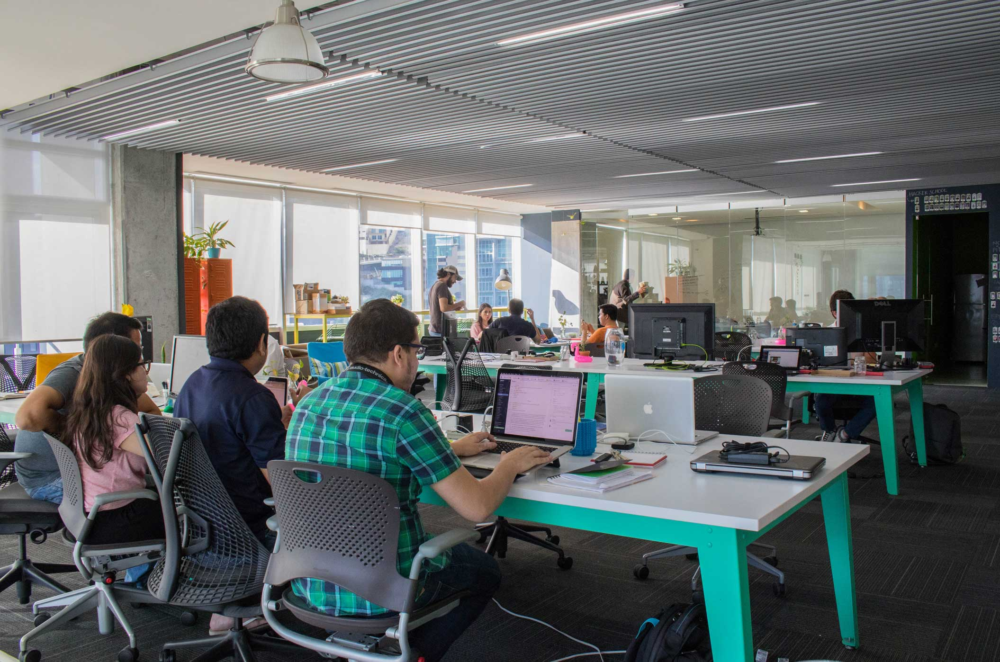
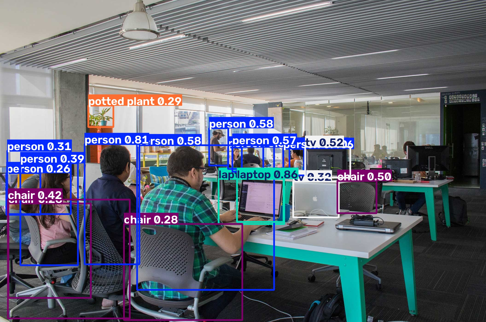
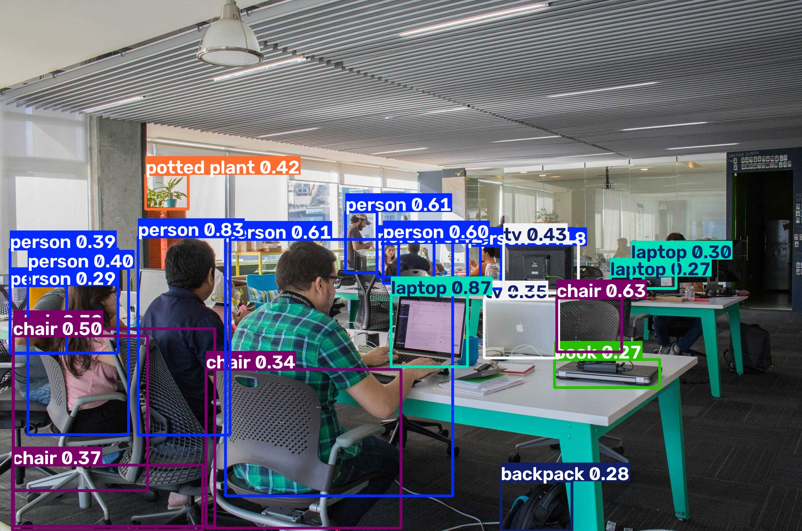
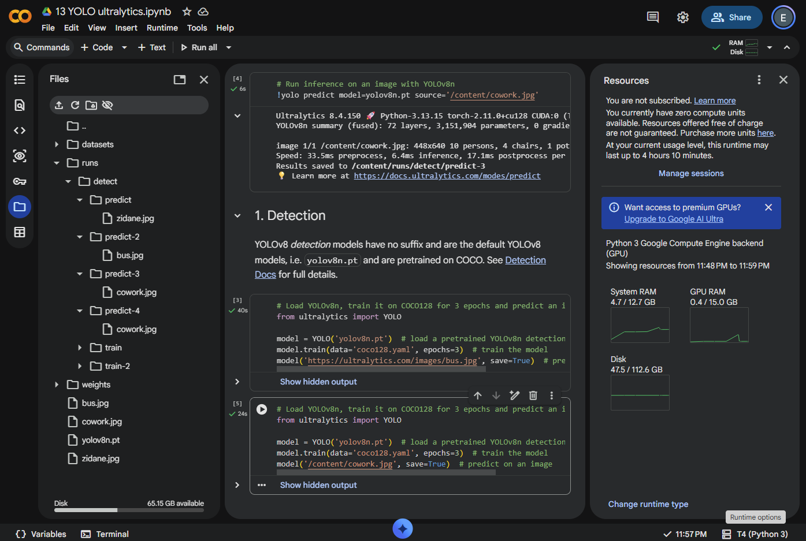
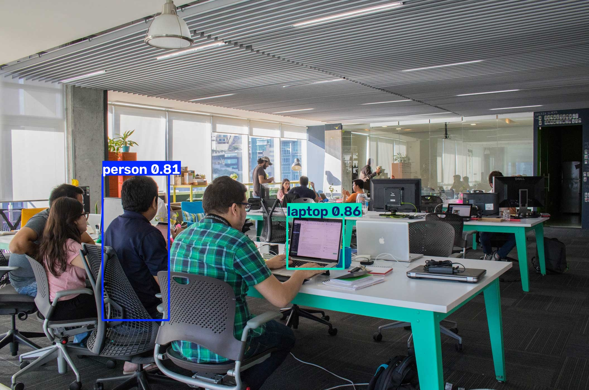

# Ejercicio 1 - Cambiar la imagen de predicción en YOLO

## Objetivo

Ejecutar YOLOv8 en Google Colab, cambiar las imágenes de ejemplo por una imagen propia y comparar los objetos detectados.

## Notebook

- **Colab:** https://colab.research.google.com/drive/1QlqCRIc0P2fjWeuArA7JzfNKeLGhfgb4?usp=sharing
- **Archivo local opcional:** [13_YOLO_ultralytics.ipynb](./13_YOLO_ultralytics.ipynb)

## Configuración

| Configuración | Valor          |
| ------------- | -------------- |
| Modelo        | `yolov8n.pt`   |
| Dataset       | `coco128.yaml` |
| Épocas        | 3              |
| Entorno       | Google Colab   |

## Imagen propia

- **Nombre del archivo:** `cowork.jpg`
- **Objetos visibles:** Personas, sillas, laptops, monitores, escritorios, una planta y una lámpara.

## Cambios realizados

### Predicción por CLI

```python
!yolo predict model=yolov8n.pt source='/content/cowork.jpg'
```

### Predicción con Python

```python
model('/content/cowork.jpg', save=True)
```

## Resultados

| Imagen                  | Clases detectadas                                       | Número aproximado de cajas |
| ----------------------- | ------------------------------------------------------- | -------------------------: |
| `zidane.jpg`            | person, tie                                             |                          3 |
| `bus.jpg`               | bus, stop sign, person                                  |                          6 |
| `cowork.jpg` por CLI    | person, chair, laptop, tv, potted plant                 |                         18 |
| `cowork.jpg` con Python | person, chair, laptop, tv, potted plant, book, backpack |                         21 |

## Reporte

En las imágenes originales, YOLO detectó dos personas y una corbata en `zidane.jpg`. En `bus.jpg` detectó un autobús, una señal de alto y varias personas. En mi imagen `cowork.jpg` encontró principalmente personas, sillas, laptops, un monitor como tv y una planta. La mayoría de las cajas corresponden a objetos que sí aparecen en la oficina, aunque algunas se sobreponen porque hay varias personas y sillas juntas.

Algunos objetos visibles no fueron etiquetados, como los escritorios y la lámpara del techo. Esto puede pasar porque no todas las clases existen con ese nombre en COCO, o porque el objeto no se parece lo suficiente a los ejemplos con los que se entrenó YOLO. También puede fallar cuando los objetos están parcialmente cubiertos, son pequeños o tienen una confianza menor al límite usado por el modelo.

Las predicciones de la CLI y de `model(...)` coincidieron en la mayoría de las clases, pero no fueron exactamente iguales. La predicción con Python agregó las clases `book` y `backpack`, además de detectar más laptops. Esto puede deberse a que la celda de Python usa el modelo después del entrenamiento de tres épocas, mientras que la CLI usa directamente `yolov8n.pt`. Por eso pueden cambiar algunas cajas y sus niveles de confianza aunque se use la misma imagen.

## Evidencias

### Predicción en zidane.jpg


### Predicción en bus.jpg


### Imagen original



### Imagen propia - CLI



### Imagen propia - Python



### Ejecución en Colab



## Reto opcional - Umbral de confianza

Se volvió a ejecutar la predicción por CLI sobre `cowork.jpg`, cambiando únicamente el umbral de confianza a 0.7.

```python
!yolo predict model=yolov8n.pt source='/content/cowork.jpg' conf=0.7
```

| Umbral         | Cajas aproximadas | Resultado                                                         |
| -------------- | ----------------: | ----------------------------------------------------------------- |
| 0.25 (default) |                18 | Detectó personas, sillas, laptops, un monitor y una planta.       |
| 0.7            |                 2 | Conservó una persona con confianza de 0.81 y una laptop con 0.86. |

Al subir el umbral a 0.7 desaparecieron casi todas las cajas. Esto pasó porque el modelo ahora solo acepta detecciones con una confianza de al menos 0.7. Las cajas que tenían valores menores, aunque señalaran objetos que sí estaban en la imagen, fueron descartadas. El resultado quedó más limpio, pero también dejó sin detectar varios objetos visibles.


