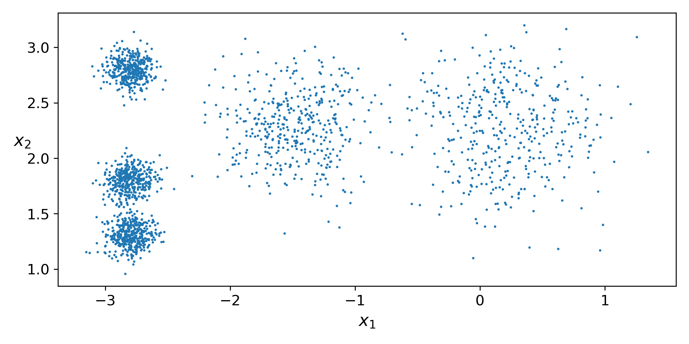
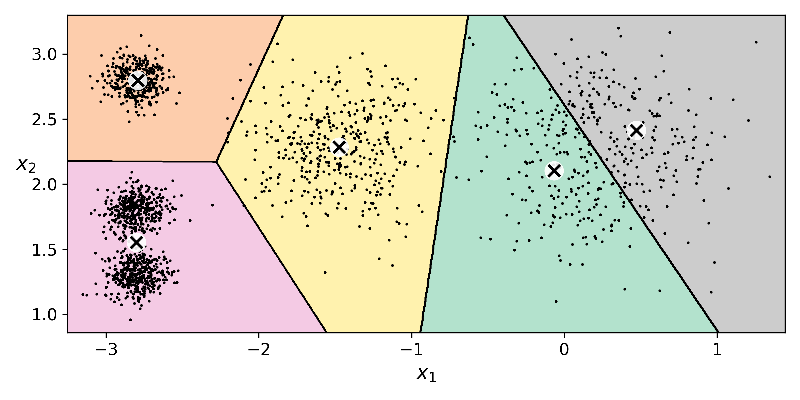
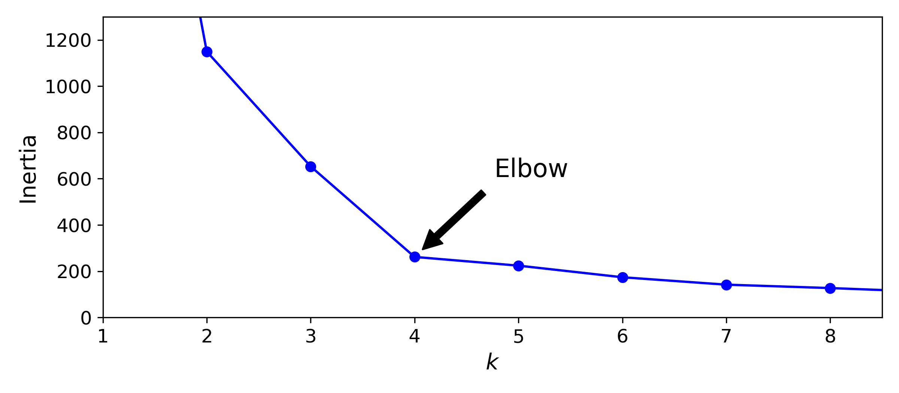
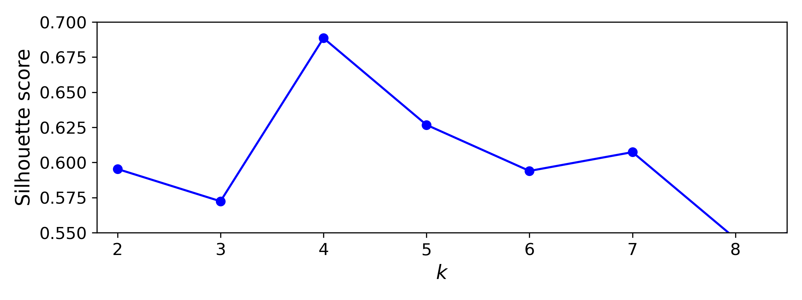
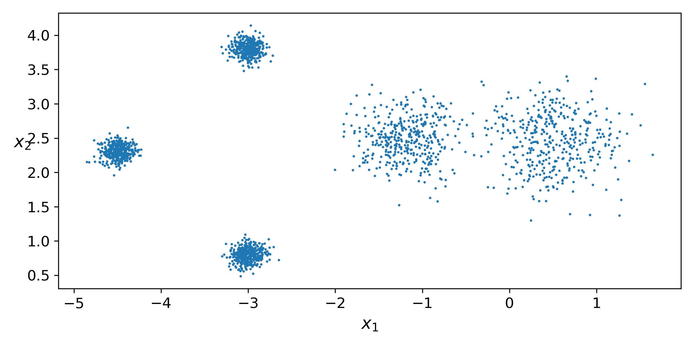
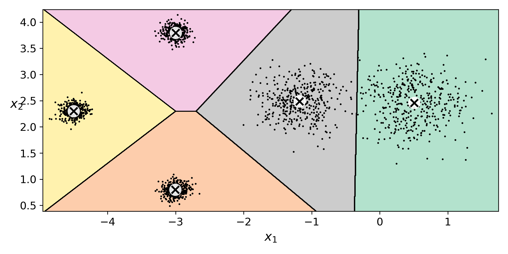
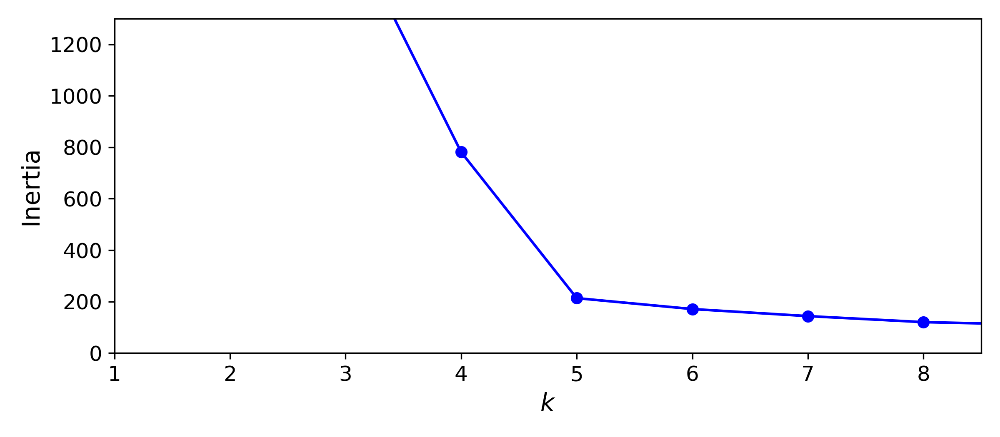
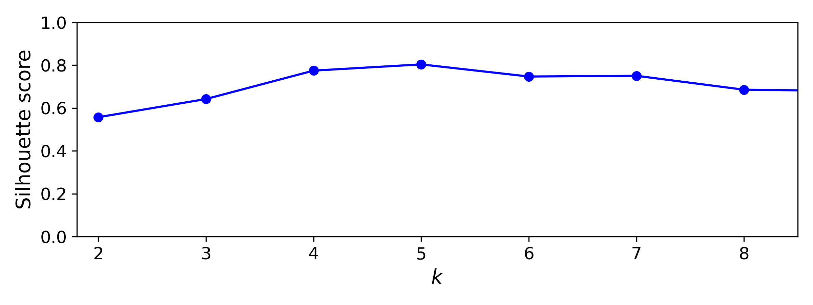
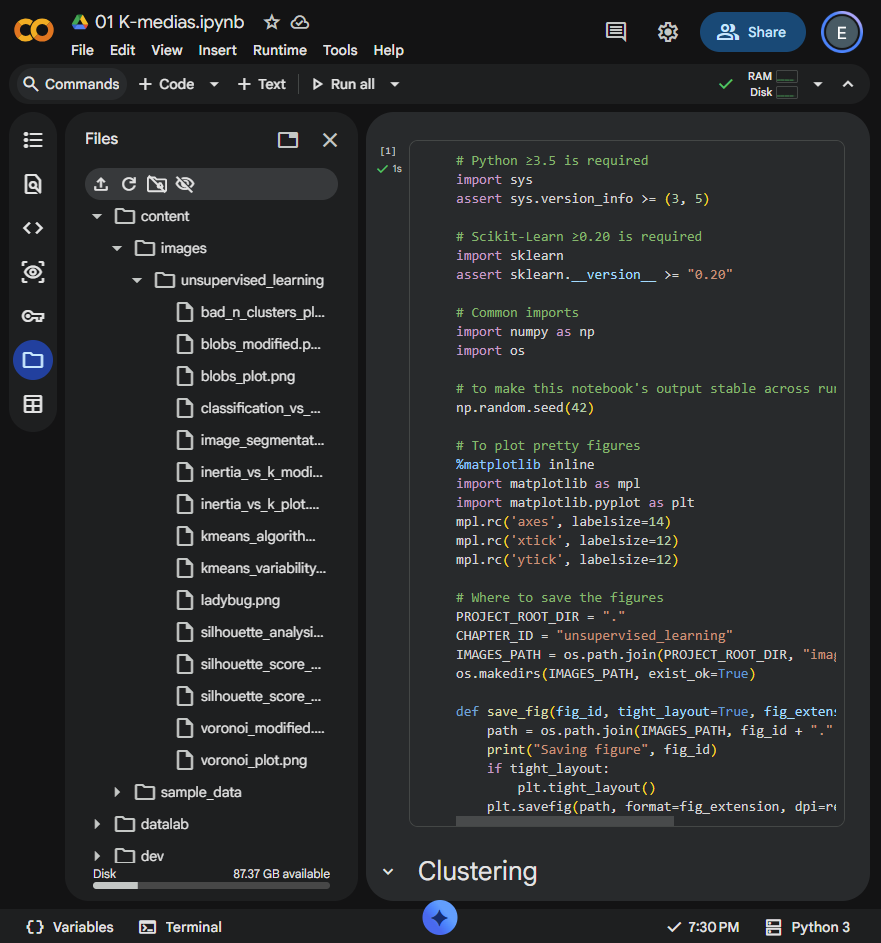

# Ejercicio 1 - Separar los blobs y volver a elegir k

## Notebook

- [Abrir en Google Colab](https://colab.research.google.com/drive/18-9mKnu1oppEG-8vwdwjrLxpG09D33Wq?usp=sharing)
- [Archivo local](./01_K_medias.ipynb)

## Configuración

Se mantuvieron los 2000 puntos, `random_state=7` para generar los datos y `random_state=42` para K-means. La primera prueba usa los datos originales de la notebook y en la segunda solo se cambiaron los centros. Se conservaron cinco centros y las mismas desviaciones.

### Centros originales

```python
blob_centers = np.array(
    [[ 0.2,  2.3],
     [-1.5,  2.3],
     [-2.8,  1.8],
     [-2.8,  2.8],
     [-2.8,  1.3]])

blob_std = np.array([0.4, 0.3, 0.1, 0.1, 0.1])
```

### Centros modificados

```python
blob_centers = np.array(
    [[ 0.5, 2.5],
     [-1.2, 2.5],
     [-3.0, 0.8],
     [-3.0, 3.8],
     [-4.5, 2.3]])

blob_std = np.array([0.4, 0.3, 0.1, 0.1, 0.1])
```

## Resultados

| Datos       | Inercia k=3 | Inercia k=5 | Inercia k=8 | Mejor k por codo | Mejor k por silueta |
| ----------- | ----------: | ----------: | ----------: | ---------------: | ------------------: |
| Originales  |    653.2167 |    224.0743 |    127.1314 |                4 |                   4 |
| Modificados |   1680.4125 |    213.3369 |    120.1060 |                5 |                   5 |

En los datos modificados, la silueta fue de `0.7748` con `k = 4` y alcanzó su valor máximo de `0.8038` con `k = 5`.

## Reporte breve

En los datos originales se crearon cinco grupos, pero tres estaban muy cerca y casi en la misma posición. Por eso K-means podía ver dos de ellos como si fueran uno solo. Esto explica por qué el codo aparecía en `k = 4`, aunque se habían usado cinco centros para crear los datos. La silueta también daba su mejor resultado con cuatro grupos.

Para la segunda prueba alejé los centros, pero dejé los mismos valores de `blob_std`. En la nueva gráfica ya se pueden distinguir mejor las cinco nubes. La inercia fue de 1680.4125 con `k = 3`, bajó a 213.3369 con `k = 5` y llegó a 120.1060 con `k = 8`. Aunque el último valor es menor, eso no quiere decir que ocho grupos sean mejores, porque la inercia siempre baja cuando se agregan más grupos. Lo importante es que ahora el cambio más claro de la curva llega hasta `k = 5`.

La silueta también cambió. Con `k = 4` dio 0.7748 y con `k = 5` subió a 0.8038, que fue el resultado más alto. Me pareció interesante que `k = 6` y `k = 7` tampoco dieron resultados tan malos, con 0.7472 y 0.7506. Esto se parece a lo que pasaba antes, cuando `k = 4` era el mejor pero `k = 5` también daba un resultado aceptable. La diferencia es que ahora el codo y la silueta coinciden en `k = 5`.

Aunque los valores arriba de cinco no son malos, visualmente no parece que mejoren la separación, porque las cinco nubes ya se distinguen y usar más grupos solamente dividiría algunas de ellas. Si el codo hubiera seguido en cuatro, tendría que haber separado todavía más algunos centros. Aumentar `blob_std` no sería la mejor opción porque haría las nubes más dispersas y podrían volver a mezclarse.

## Evidencias

### Datos originales









### Datos modificados









### Ejecución en Colab


