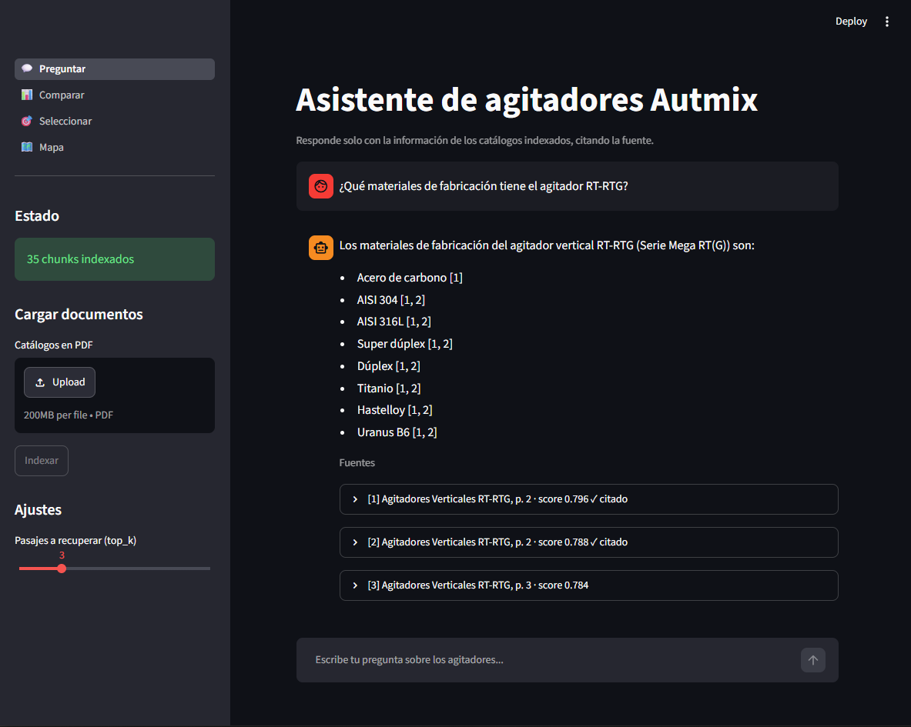
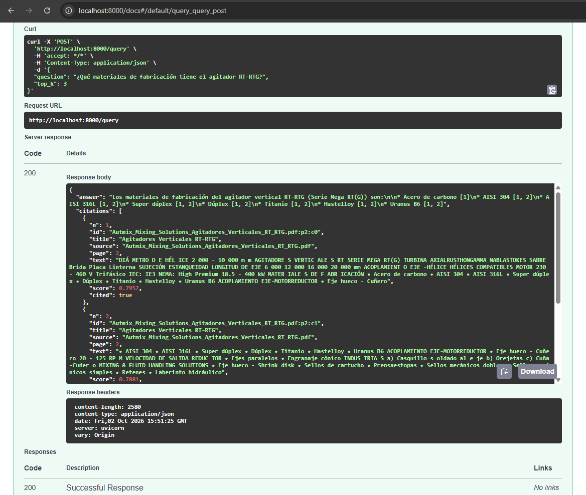
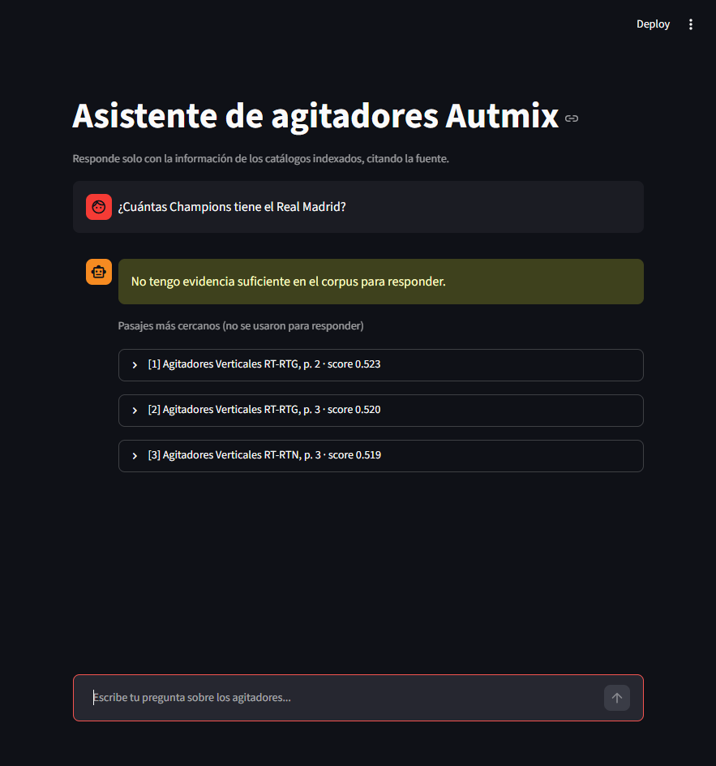
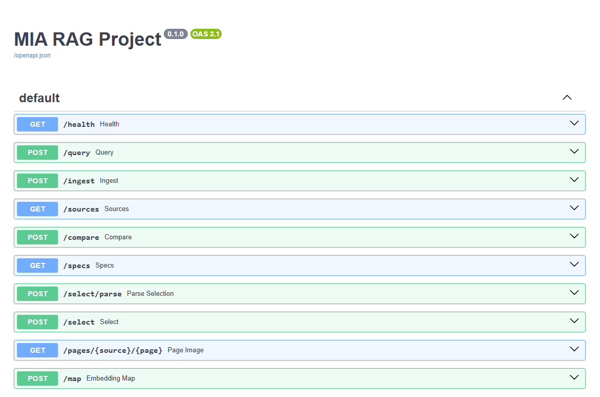
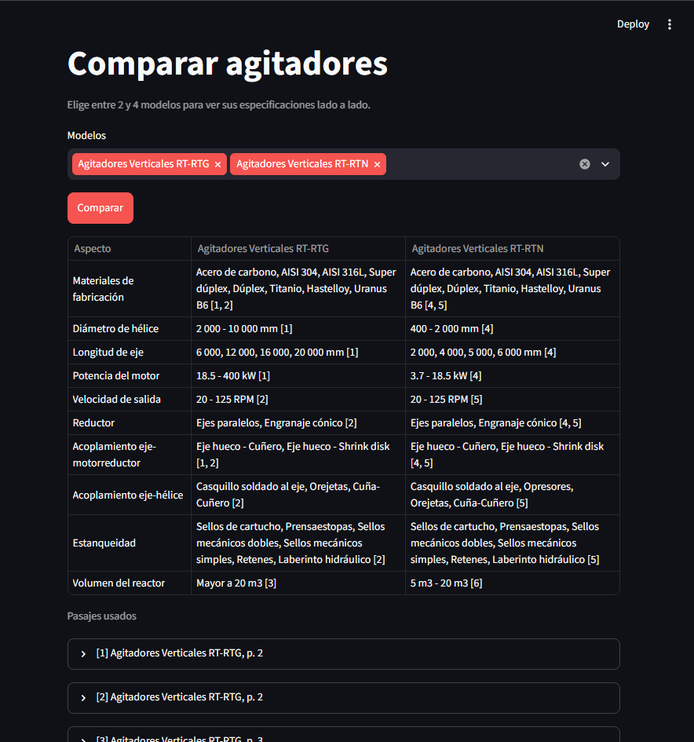
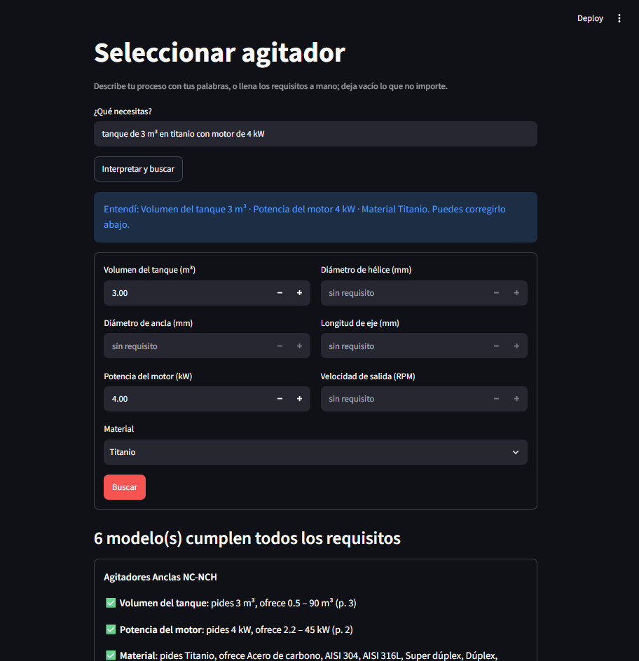
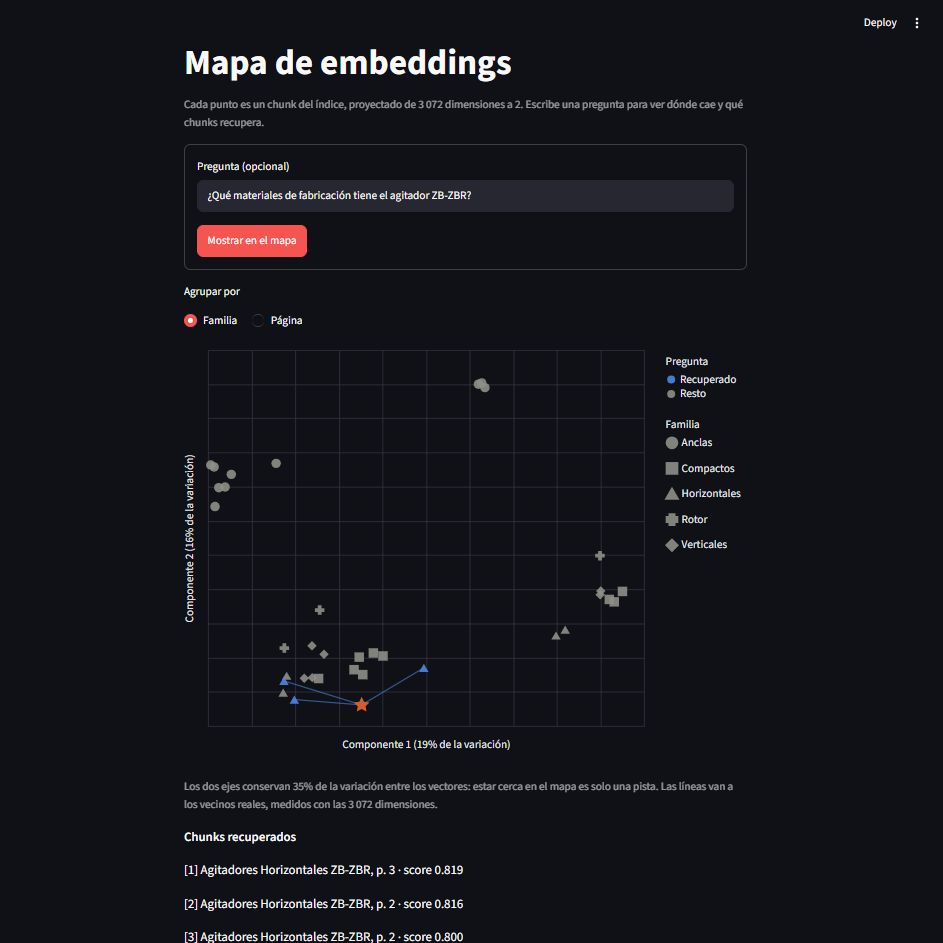

# RAG over Autmix agitator brochures

A retrieval-augmented generation system that answers questions about Autmix
industrial agitators using only their public product brochures. Answers are
written in Spanish, cite the passages they come from as `[n]`, and the system
abstains when the brochures don't contain the answer.

On top of the question answering required by the assignment, the app can
compare models side by side, select the models that meet a set of
requirements, show the brochure page behind every citation, and draw the
index as a map.

The assignment's report is [`REPORT.md`](./REPORT.md) (in Spanish): the
corpus, how it's chunked and why, the abstention rule with the scores behind
it, and what Google AI and ChromaDB each do. This README covers how to run
the system and how it works.

| Layer | Technology | Role |
|---|---|---|
| UI | Streamlit | Ask, compare, select and explore; shows answers with their sources, scores and pages |
| API | FastAPI | Every operation, documented at `/docs` |
| Index | ChromaDB | Persistent store of chunks + vectors, cosine k-NN search |
| Embeddings | Google AI (`gemini-embedding-001`) | One vector per chunk and per question |
| Generation | Google AI (`gemini-3.5-flash`) | Grounded answers, comparison tables, spec extraction |

A question goes from the Streamlit UI (port 8501) to the FastAPI API (port
8000) over HTTP. The API embeds it with Google AI, retrieves the `top_k`
nearest chunks from ChromaDB, and asks Gemini to answer from those chunks only.

The UI never talks to ChromaDB or Google AI directly; everything goes through
the API.

## Corpus

`data/` holds 11 public Autmix brochures (33 pages, about 3,200 words), one per
agitator series: anchors (NC-NCH, NC-NCS, NC-NCT), compact (CT-CTF, CT-CTI,
CT-CTR), horizontal (ZB-ZBP, ZB-ZBR), rotor (RE-RES) and vertical (RT-RTG,
RT-RTN). All of them have a text layer, so no OCR is needed.

## Setup

Requires Python 3.13 (other recent versions may work but weren't tested).

```bash
cd final-project
python -m venv venv
```

Activate the virtual environment:

```bash
# Windows (PowerShell)
.\venv\Scripts\Activate.ps1
# macOS / Linux
source venv/bin/activate
```

Install the dependencies:

```bash
python -m pip install -r requirements.txt
```

### Google AI key

1. Create a key at [Google AI Studio](https://aistudio.google.com/apikey).
2. Copy `.env.example` to `.env` and paste the key:

   ```
   GOOGLE_API_KEY=your-key
   ```

`.env` is gitignored. The API reads it from `final-project/.env` no matter
which folder you start it from.

**Quota.** On the free tier Google allows only about 20 answer requests per
day for `gemini-3.5-flash`. When the quota runs out, questions fail with
`Error de Google AI: 429 RESOURCE_EXHAUSTED`; that means the quota is used up,
not that the installation is broken. Linking a prepaid billing account in AI
Studio removes the daily limit (each answer costs a fraction of a cent).

## Running

Start the API and the UI in two terminals, both from `final-project/` with the
virtual environment active.

```bash
uvicorn app.main:app --port 8000
```

```bash
streamlit run ui/streamlit_app.py
```

- UI: http://localhost:8501
- API docs: http://localhost:8000/docs

Start uvicorn **without** `--reload`. On Windows the reloader can hang after a
file change: it prints `Reloading...` but keeps serving the old code. Restart
the API by hand after changing anything in `app/`.

The UI calls the API at `http://127.0.0.1:8000` (override with the
`RAG_API_URL` environment variable). It uses `127.0.0.1` rather than
`localhost` because on Windows `localhost` tries IPv6 first and adds about two
seconds to every request.

### Indexing the corpus

A fresh clone starts with an empty index (`chroma/` is created on first use).
Index the brochures in either of two ways:

- **From the UI:** select the PDFs in *Cargar documentos* and click *Indexar*.
  This also extracts each brochure's specifications for the selector.
- **From the command line:**

  ```bash
  python -m scripts.check_store
  ```

  indexes every PDF in `data/` and runs a test question. Then build the
  selector's data:

  ```bash
  python -m scripts.build_specs
  ```

The index lives in `chroma/` and the specifications in `specs.json`; both
survive restarts, are gitignored and can always be rebuilt. Indexing the same
file again overwrites its chunks and specifications instead of duplicating
them.

Run the scripts **before starting the API, or restart the API after them.**
Chroma keeps its search index in memory in each process, and a running API
doesn't see what another process writes: it would report the new chunks in
`/health` but find none when searching. Uploading from the UI doesn't have
this problem, because the API writes the chunks itself.

### With Docker Compose

`docker-compose.yml` runs the API and the UI as two services from one image.
The index and `specs.json` live in a Docker volume (`index`), so they survive
`docker compose down`; `data/` is shared with the host. Both ports are
published on `127.0.0.1` only. The key is read from `.env` at runtime and is
never copied into the image.

```bash
docker compose build
```

Index the corpus before starting the services (see the note above):

```bash
docker compose run --rm api python -m scripts.check_store
```

```bash
docker compose run --rm api python -m scripts.build_specs
```

Then start both services, at the same addresses as before:

```bash
docker compose up -d
```

`docker compose down` stops them and keeps the index; `docker compose down -v`
also deletes the index.

### Trying it

Ask in the UI, or call the API directly:

```bash
curl -X POST http://localhost:8000/query \
  -H "Content-Type: application/json" \
  -d '{"question": "¿Qué materiales de fabricación tiene el agitador RT-RTG?", "top_k": 3}'
```

Expected: an answer listing the RT-RTG materials with `[n]` citations, and the
cited chunks with their source, page and score. A question the brochures
can't answer, such as *¿Cuál es el precio del agitador RT-RTG?*, returns
`"abstained": true` with *No tengo evidencia suficiente en el corpus para
responder.*

## The app

The sidebar shows the index status, the upload form and the `top_k` setting on
every page.

| Page | What it does |
|---|---|
| **Preguntar** | Chat. Each answer lists its passages with title, page and score, marks the ones it cites, and shows the brochure page next to each passage. |
| **Comparar** | Pick 2 to 4 models and get a table of their specifications, each cell cited. |
| **Seleccionar** | Enter requirements (tank volume, propeller and anchor diameter, shaft length, motor power, output speed, material), or describe them in Spanish, and get the models that meet all of them, with the reason and page for each check. |
| **Mapa** | Every chunk of the index projected to 2D; a question appears as a star with lines to the chunks it retrieves. |

### Example inputs

With the 11 brochures indexed (`top_k` = 3), these give the results shown.

**Preguntar**

| Question | Expected |
|---|---|
| ¿Qué materiales de fabricación tiene el agitador RT-RTG? | Answers: carbon steel, AISI 304, AISI 316L, super duplex, duplex, titanium, Hastelloy, Uranus B6, citing RT-RTG p. 2 (score 0.796) |
| ¿Qué potencia de motor tienen los agitadores compactos? | Answers with one range per compact model (CT-CTR, CT-CTF, CT-CTI), each cited |
| ¿Cuál es el precio del agitador RT-RTG? | Abstains: on topic (score 0.764), but no brochure gives a price |
| ¿Quién ganó el mundial de 2022? | Abstains before calling Gemini (score 0.535, below 0.65) |

**Comparar**

| Models | Expected |
|---|---|
| Agitadores Verticales RT-RTG + RT-RTN | 10 rows. Same materials; propeller diameter 2 000–10 000 mm vs 400–2 000 mm; motor 18.5–400 kW vs 3.7–18.5 kW; every cell cited to its own brochure |

**Seleccionar**

| Input | Expected |
|---|---|
| Volumen del tanque `50`, Material `AISI 316L` | 6 models: NC-NCH, NC-NCS, NC-NCT, ZB-ZBP, ZB-ZBR, RT-RTG |
| Volumen del tanque `200` | 3 models: ZB-ZBP, ZB-ZBR, RT-RTG (RT-RTG's brochure says "Mayor a 20 m³", an open range) |
| *¿Qué necesitas?* `tanque de 3 m³ en titanio con motor de 4 kW` | Understood as 3 m³, 4 kW, Titanio; 6 models: NC-NCH, NC-NCS, NC-NCT, CT-CTI, CT-CTR, ZB-ZBR |

**Mapa**

| Input | Expected |
|---|---|
| ¿Qué materiales de fabricación tiene el agitador RT-RTG? | A star with lines to three RT-RTG chunks (p. 2 and p. 3); the axes keep 19% and 16% of the variation |

## Evidence

The three captures the assignment asks for come first; the rest show the
other endpoints and pages. All of them are in [`evidence/`](./evidence/).

**1. An answer with citations and scores.** *¿Qué materiales de fabricación
tiene el agitador RT-RTG?* is answered with the eight materials, each cited;
the sources list their page, score and whether the answer cites them.



**2. The same question through the API.** `POST /query` in `/docs` returns
the same answer, the citations with their scores, and `cited: true` on the
passages used.



**3. An out-of-domain question.** *¿Cuántas Champions tiene el Real Madrid?*
abstains: the closest passage scores 0.523, below `MIN_SCORE` (0.65), so
Gemini isn't called.



**4. An in-domain question without an answer.** *¿Cuál es el precio del
agitador RT-RTG?* scores 0.764, as high as a real question, and still
abstains: Gemini finds no price in the passages.


**5. Every endpoint in `/docs`.**



**6. Comparison of RT-RTG and RT-RTN**, every cell cited to its own brochure.



**7. Selection from a request in Spanish.** *tanque de 3 m³ en titanio con
motor de 4 kW* is understood as 3 m³, 4 kW and titanium, and 6 models meet
all three, each check with its page.



**8. Embedding map.** *¿Qué materiales de fabricación tiene el agitador
ZB-ZBR?* lands among the horizontal agitators, with lines to its three real
neighbours, all ZB-ZBR chunks.



## API

| Method | Path | Body | Returns |
|---|---|---|---|
| GET | `/health` | | API status, whether Chroma is reachable, number of chunks |
| POST | `/ingest` | multipart, field `files` (one or more PDFs) | documents and chunks indexed, skipped files with the reason, warnings |
| POST | `/query` | `{"question": str, "top_k": 1-10 (default 3), "source": str or null}` | `answer`, `citations` (n, id, title, source, page, text, score, cited), `abstained` |
| GET | `/sources` | | indexed brochures: file name, model title, number of chunks |
| POST | `/compare` | `{"sources": [2 to 4 distinct file names]}` | models, table rows with cited cells, the numbered passages |
| GET | `/specs` | | the extracted specifications of every model |
| POST | `/select` | requirements (at least one), e.g. `{"tank_volume_m3": 50, "material": "AISI 316L"}` | `matches` and `rejected`, each with its checks |
| POST | `/select/parse` | `{"text": "tanque de 3 m³ en titanio"}` | the requirements understood, plus what can't be filtered on |
| GET | `/pages/{source}/{page}` | | the brochure page as a JPEG |
| POST | `/map` | `{"question": str or null, "top_k": 1-10}` | 2D points for every chunk, and the question's position and real neighbours |

`source` in `/query` restricts the search to one file, e.g.
`"Autmix_Mixing_Solutions_Agitadores_Verticales_RT_RTG.pdf"`.

Invalid input is rejected before it reaches the pipeline: blank or overlong
questions and out-of-range numbers return 422; uploads that aren't real PDFs
(checked by content, not extension), are damaged, have no text, exceed 20 MB
or have an unsafe file name are listed in `skipped`. A missing key returns 503
and a Google AI failure returns 502, so an out-of-domain question never causes
a 500.

## How a question is answered

1. **Chunking** (`app/loader.py`, `app/chunk.py`). Each PDF is read page by
   page. Cover pages (under 20 words) are skipped, the contact footer repeated
   on every brochure is cut, and the rest is split into windows of 100 words
   with 25 words of overlap. Each chunk is embedded with the agitator model
   name in front (e.g. `Agitadores Verticales RT-RTG. ...`), because the
   brochures share one template and would otherwise be nearly identical.
2. **Embedding** (`app/embed.py`). Chunks are embedded with
   `task_type=RETRIEVAL_DOCUMENT` and questions with `RETRIEVAL_QUERY`, using
   the same model for both.
3. **Retrieval** (`app/store.py`). Chroma returns the `top_k` nearest chunks
   in cosine space; score = 1 − distance.
4. **Answer** (`app/generate.py`). Gemini gets the numbered passages and the
   question, with a thinking budget of 1,024 tokens; with thinking disabled it
   abstained on broad questions it could answer. See the abstention rule below.

### Abstention rule

The system abstains in three cases:

1. **The best chunk scores below `MIN_SCORE` = 0.65** (`app/main.py`). Gemini
   isn't called. Off-topic questions scored 0.53–0.57 in testing, answerable
   ones 0.75–0.80.
2. **Gemini replies with the abstain text.** The prompt tells it to answer
   only from the numbered passages and to reply exactly *No tengo evidencia
   suficiente en el corpus para responder.* when they don't contain the
   answer. This catches in-domain questions with no answer in the brochures,
   such as prices, which score as high as real questions (0.76).
3. **The answer cites no passage.** An answer that can't be traced to the
   corpus is replaced by the abstain text.

## Beyond the required system

### Model comparison (`app/compare.py`)

A comparison doesn't search: it needs each model's whole spec sheet, so it
fetches all the chunks of the chosen brochures, numbers them, and asks Gemini
for a table through a JSON schema. Two details keep it reliable:

- Models are labelled `A`–`D` in the prompt, and the schema only allows those
  letters, so Gemini can't answer with a name from the brochure text instead
  of the model's title.
- Every cell is checked in Python: a citation counts only if it points to that
  model's own passages; a value without a valid citation becomes *No
  especificado*. The rows follow a fixed list of aspects, so the same models
  always give the same table.

### Agitator selector (`app/specs.py`)

Gemini reads each brochure **once**, when it's indexed, and turns its text into
numeric ranges with the page they come from (`specs.json`). Selecting models is
then a plain comparison in Python: instant, free and repeatable. Open ranges
are kept as such (*"Mayor a 20 m³"* has no maximum), and a requirement the
brochure doesn't mention counts as not confirmed.

Requests in Spanish (*"tanque de 3 m³ en titanio con motor de 4 kW"*) go
through `/select/parse`: Gemini converts units and maps words to the known
materials, Python checks every value, and the page shows what was understood
so it can be corrected before searching.

`python -m scripts.check_specs` checks `specs.json` against the brochure text:
every extracted number must appear in its brochure, construction materials
must not include coatings, and diameters must match their printed labels.
Run it after every extraction; Gemini's output varies between runs.

### Brochure pages (`app/pages.py`)

`/pages/{source}/{page}` renders a page with pypdfium2, so every citation in
the chat, the comparison and the selector can show the page it comes from.
The file name comes from the URL, so it must name a PDF directly inside
`data/`; anything else returns 404. Uploaded PDFs are saved to `data/` under a
sanitized name.

### Embedding map (`app/embedding_map.py`)

The 3,072-dimension vectors are projected to 2D with PCA, which is
deterministic and lets a question be placed on the same map. The two axes keep
about 35% of the variation, so closeness on the map is only a hint; the lines
from a question go to its real neighbours. Grouped by page, the chunks
separate much more clearly than grouped by family: the shared template
dominates the embeddings, which is why the model name is prepended to every
chunk.

## Security

- The API listens on `127.0.0.1` only. Don't start it with `--host 0.0.0.0`:
  no endpoint checks who is calling.
- The key is only read from `.env`; no endpoint returns it.
- Request bodies are validated by Pydantic schemas, upload names are
  sanitized, and page requests can't leave `data/`.

## Project structure

```
final-project/
  README.md            this file: running and design
  REPORT.md            the assignment's report (in Spanish)
  app/
    main.py            FastAPI app: every endpoint
    schemas.py         request and response models
    loader.py          reads a PDF into one record per page
    chunk.py           cleaning and overlapping word windows
    embed.py           Google AI client and embeddings
    store.py           ChromaDB: upsert, top-k query, reads by source
    generate.py        prompt, Gemini call, citation parsing, abstention
    compare.py         side-by-side comparison
    specs.py           spec extraction, selection, parsing of requests
    pages.py           page rendering and safe file names
    embedding_map.py   PCA projection of the index
  ui/
    streamlit_app.py   entry point: sidebar and navigation
    api.py             HTTP client for the API
    brochure.py        shows a brochure page
    views/             chat, compare, select and map pages
  scripts/             checks and builds run by hand
    check_chunks.py    chunking of every PDF in data/
    check_embed.py     embedding sanity check
    check_store.py     indexes data/ and runs a test question
    build_specs.py     extracts specifications into specs.json
    check_specs.py     checks specs.json against the brochure text
  utils/vectors.py     cosine similarity used by the checks
  Dockerfile           one image for the API and the UI
  docker-compose.yml   the two services, the index volume and the ports
  data/                the 11 brochures
  chroma/              persistent index (gitignored, created on first use)
  specs.json           extracted specifications (gitignored, rebuilt by build_specs)
```

## Credits

The word-window chunker, the `Retrieved` result shape, the prompt layout and
the cosine helpers are adapted from the course's `RAG/project/rag/` package.
The brochures are public material from Autmix.
